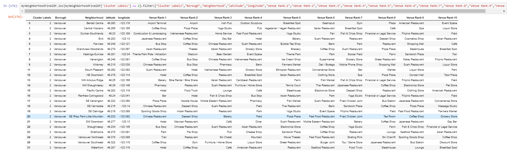

# Predicting Neighbourhoods for opening Indian Restaurant in British Columbia, Canada

Ajay Kumar Rabidas. 
July 5, 2019 (Capstone Week 3)

## 1. INTRODUCTION

_We all know that Indians could be found in every part of the world, but we are going to focus our attention towards British Columbia, Canada is one of the countries which allows a lot of immigrants to become a permanent resident or work there. This creates a big opportunity of diverse businesses to flourish. A restaurant business is one of them. Every neighbourhood in every country in the entire world has some type of restaurant. Because people of different countries and cultures live in Canada and according to a survey of the Canadian government, most immigrants are from Asian countries. Another survey shows that the second most recognized language spoken in British Columbia is Punjabi. This makes it obvious that there would be a huge requirement of Asian eat outs there._ 

## 2. PROBLEM STATEMENT

_In cities across the world there are neighbourhoods that concentrate most of the activity and other neighbourhoods that concentrate most of the housing space. In this project I want to explore the differences between areas of a city, analysing the kind of activities that create the most important leisure centres and exploring the changes, new businesses or activities, required to be created in some regions to make them more similar to the areas that concentrate the activity. For this instance, we are concentrating on opening an Indian restaurant in a neighbourhood that doesn’t have many, which could comfort the native Indians and hint them to consider choosing that place for living. Which could result in spreading out the Asian immigrant population to less dense areas and ultimately proper development across all areas of British Columbia. 
We will start with the most populated and active place and try diverging from there. Once the boundary is broken the spread could be unlimited. There wouldn’t be a restriction on immigrants’ mind that Indian should prefer Victoria or Vancouver only for immigrating. 
Looking at the background it seems very easy to judge that an Indian restaurant business is going to flourish in British, Columbia. But the problem here is to find a neighbourhood for opening that restaurant. British Columbia is a big place to choose from. My problem statement for this project would be to analyse the neighbourhood of British Columbia and try to find a neighbourhood that is best suited for opening a new Indian restaurant business and in the process figure out if a neighbourhood is good for moving in._

## 3. DATA

### 3.1. Data Source

Based on definition of our problem, factors that will influence our decision are: 
* Number of existing any type of restaurants in the neighbourhood 
* Number of Indian restaurants in the neighbourhood

Following data sources will be needed to extract/generate the required information: 
* Centres of candidate co-ordinates would be extracted from a webpage URL: http://www.geonames.org/postal-codes/CA/BC/british-columbia.html 
* Number of restaurants and their type and location in every neighbourhood will be obtained using Foursquare API (https://en.foursquare.com/) 

### 3.1 Data Cleansing:

Since the geonames.org website does not follow the best html standards

_The first step would be to extract information from it. I would be using a web scraping framework to load the relevant data to a pandas data-frame._ 

_Secondly, cleaning the data is important because the neighbourhood names and latitudes and longitudes are inappropriately formatted._

_Thirdly, I will be using foursquare to get active venues of all the neighbourhoods._

All the data is combined into a data-frame that contains all the explicative variables for every section of the city. The information is then vectorised to include a count of the number of services offered in every section, that is, the total number of parking slots, total number of gardens, total number of parks is computed. This information is complemented with the information obtained from Foursquare, thus including information about the number of cafeterias, restaurants, clothing shops and other businesses in every section. The so formed dataset will be the working dataset for the project. 

A clustering algorithm will then be used to classify the different section into groups of similar sections. The total number of clusters will be selected in such a way that the clustering is compatible with the field experience, that is, ensuring that each cluster really represent a quantity and quality of activity that can be observed on the field. If discrepancies are observed between the clustering algorithm output and the classification based on experience, different machine learning techniques will be tested to map the section characteristics to the group assigned by experience and field work. The objective of the previous task is to construct the decision boundaries that separate the different classes. Once these boundaries have been constructed, it will be easy to compute the minimal set of changes that should be implemented into one section of the city to transform it into a different type, that is, how to modify one section to change the overall level of activity and make it more similar to the objective that we may be pursuing as decision-makers. 

The dataframe obtained from the above mentioned procedures are not directly usable with any analytical algorithm. Here is a brief description of the data received from the webpage and preliminary corrections:

As we can see, the location data obtained from the webpage is not usable, and multiple Neighbourhood names are duplicate if we remove north, south, east, and west from their names. Foursquare API was unable to work with such names. Multiple other records didn’t have a Borough name. After cleansing, the final data frame looks like this:

Here is how the data looks when plotted on a folium map:

Using the value_counts() function neighborhoodDF['Borough'].value_counts() we can see that Vancouver has the maximum number of neighbourhood data available and since it is also the most populates and famous city for immigrants. Since our plan is to start from the most populated city and extend outwards, which means if we open up an Indian restaurant in less restaurant dense areas of Vancouver we could be able to attract Asian population thereby increase our chance of profitability. 
Also more number of immigrants would get the hint of their community presence there which would help immigrant population spread out of the populated area

## 4. METHODOLOGY

_On directing our efforts on detecting areas of Vancouver that have low restaurant density. In first step we have collected the required data: location and type (category) of every restaurant in from Vancouver centre. We have also identified Asian restaurants (according to foursquare categorization). Second step in our analysis is exploration of different areas of Vancouver - we will calculate the count of each venue category in a given area, which gives us a basic understanding of the type of the area. Third step is to rank top 10 venues in every neighbourhood to get a proper view of the neighbourhood._

_In fourth and final step we will focus on most promising areas by creating clusters of locations that are of similar type: we will take into consideration locations with no more than two restaurants, and we want locations without Indian restaurants. We will create clusters (using k-means clustering) and present map of all such locations._

## 5. RESULT

_Looking at the cluster markings on the map below gives us an idea that the Purple areas are of similar type and Vancouver being one of the most developed and populated cities in British Columbia would be difficult to consider opening a new restaurant as it would already be crowded of many others. We see the same looking at the dataset for the cluster label 1 which is purple on the map. It confirms our assumption. It has a huge number of Asian restaurants_

_The neighbourhoods marked as 1, 3 and 4 in red, cyan and sky seems to be the best place to open a new Indian restaurant business as they have a very low density on restaurants._

_To verify our findings we can look at the data below, we don’t have a competition in this region and it also appears to be a residential area:_

## CONCLUSION

_We started this project to explore the British Columbia for opening an Indian restaurant business. Starting from a huge country, to narrowing down to 4 specific cities was really interesting. Going through the project has made me realise the power of data science tools. The methodology however may be applied to larger cities, where the larger amount of population and the larger space to cover, can generate opportunities to improve the presence of important commercial activities for the section or the neighbourhood._
